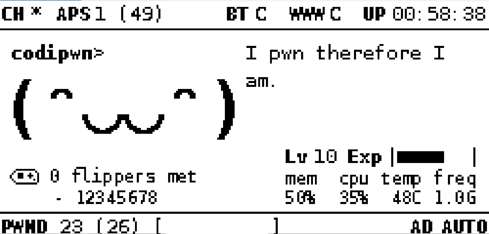

# codipwn
My pwn ownagotchi

The purpose of this repository is a backup of my pwnagotchi configuration to able to reproduce it if needed. Feel free to use my config.  



## Initial installation 
https://github.com/jayofelony/pwnagotchi/wiki

I use both bt-tether and the ethernet gadget drivers. 

Also I use a Raspberry Pi Zero 2 W for this. I haven't got my screen yet, but I'm going to use a Waveshare 2.13 V2 e-ink display. The screen is not included in the configuration yet. 

## Plugins 
A list of all the available plugins can be found here: 
https://docs.google.com/spreadsheets/d/1os8TRM3Pc9Tpkqzwu548QsDFHNXGuRBiRDYEsF3-w_A/htmlview


You can find the custom plugins files in: 
```
/usr/local/share/pwnagotchi/custom-plugins
```

List of used plugins: 
- auto-tune 
- bt-tether
- enable_assoc
- enable_deauth
- expv2
- fix_services
- handshakes-dl-hashie
- hashieclean
- instattack - Disabled usually 
- internet-connection 
- logtail 
- memtemp-plus
- pwndroid - Requires pwndroid application
- session-stats 
- webcfg
- webgpsmap - Works hand in hand with pwndroid
- wof
- wpa-sec
- wpa-sec-list

### auto-tune 
Enabled by default, comes with the image. 

### bt-tether
A plugin for connecting your phone to the pwnagotchi and sharing internet with it. 

I use an android phone for this. 

First step is to go into bluetoothctl and 
1. pair with your phone
2. trust your phone 

You also have to go into your phone and enable bluetooth tethering.  

And in the config.toml you have to fill the phone name and bluetooth mac address. 

Sometimes configuring bluetooth fails miserably, this can help: 
https://pwnagotchi.org/common-issues/index.html

I had the bluetooth service fail entirely at some point when I tried to send gps data using pwndroid. What worked was rebooting the pi, twice, also removing my bluetooth mac address using bluetoothctl and pairing and trusting again my phone. 
Bluetooth still fails from time to time and I found that rebooting the pi works.   

### enable_assoc
!!! **Modified plugin.** I removed the count indicator. 

You can use `wget` to download the plugin into your pi directly from this repository. 

Original code: https://github.com/Sniffleupagus/pwnagotchi_plugins/blob/main/enable_assoc.py

### enable_deauth
!!! **Modified plugin.** I removed the count indicator. 

You can use `wget` to download the plugin into your pi directly from this repository. 

Original code: https://github.com/Sniffleupagus/pwnagotchi_plugins/blob/main/enable_deauth.py

### expv2
No special changes made here. 

### fix_services
Enabled by default, comes with the image. 

### handshakes-dl-hashie
No special changes made here. 

### hashieclean
No special changes made here. Dont forget to get hcxpcapngtool, compile and install them. 

You can find hcxpcapngtool and the guide here: 
https://github.com/ZerBea/hcxtools

### instattack - Disabled usually 
No special changes made here. 

### internet-connection 
No special changes made here. 

### logtail 
Not enabled by default, comes with the image. 

### memtemp-plus
No special changes made here. 

### pwndroid - Requires pwndroid application
No special changes made here. 

### session-stats 
Not enabled by default, comes with the image. 

### webcfg
Not enabled by default, comes with the image. 

### webgpsmap - Works hand in hand with pwndroid
Not enabled by default, comes with the image. 

### wof
Best to follow the tutorial here:
https://github.com/cyberartemio/wof-pwnagotchi-plugin

The way I did it was by adding the repository in the config. Then I installed the plugin using 

```
sudo pwnagotchi plugins update 
sudo pwnagotchi plugins list 
sudo pwnagotchi plugins install wof 
sudo systemctl restart pwnagotchi 
```

Then I used `wget` to get the required assets. 

Don't forget the important part of installing Wall of Flippers. 

You can use the pwnagotchi install guide from here: 
https://github.com/cyberartemio/Wall-of-Flippers

### wpa-sec
No special changes made here. Requires you to fill the key in the config. 

Generate your key here: https://wpa-sec.stanev.org/

### wpa-sec-list

No special changes made here. 